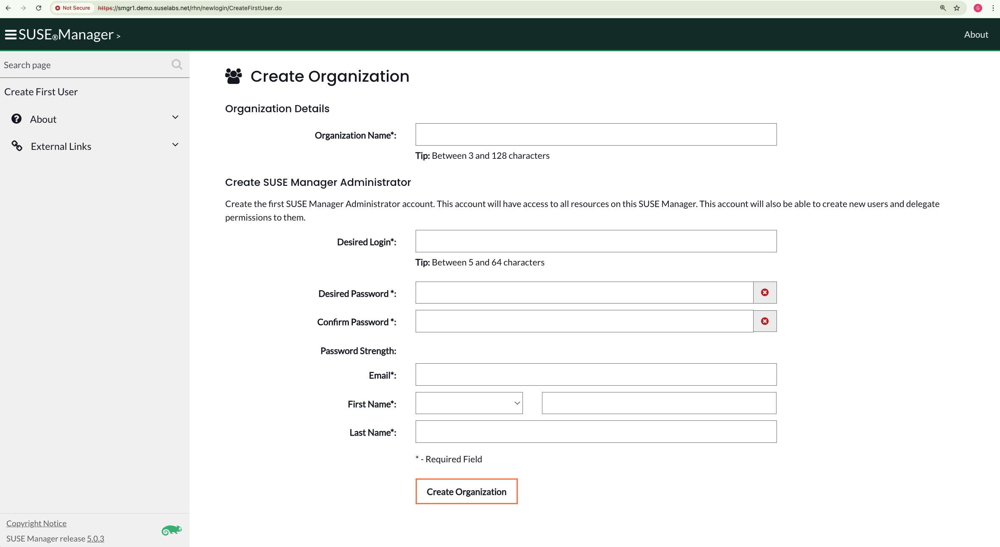

# aws-suse-manager
Terraform and scripts to show suse multi-linux manager deployment

## SUSE Multi-Linux Manager Lab
This repo contains some terraform to create multiple lab instances of SUSE Multi-Linux Manager 5.x on SUSE Linux Micro AMIs along with a number of SLES instances for use as test clients.  

The number of smgr instances is adjusted using the count parameter in the tf/terraform.tfvars file.  

As the instance is SL Micro a Combustion script is injected using a number of userdata scripts, these are generated in the tf subdirectory from a template file in templates using the script parse-userdata-template.sh  

The userdata combustion script registers the SL Micro instance with SUSE SCC as well as adding the SUSE Manager extension entitlement to the host.  

When suse manager is installed a fqdn hostname is specified, the terraform creates a number of CNAME alias entries, one for each smgr instance, these values are specified in each userdata-smgrX.sh script.  This is achieved in the tf/instances.tf smgr entry using a local data lookup map defined in tf/data.tf  

SL Micro transational-update operations need some installs so a systemd script is created by the combusion step that runs after the first boot and performs smgr install steps, reboots etc  

Some sleep timers have been inserted to allow the smgr install to initialise so need to wait 10-15 minutes for it to complete, look for /root/.suse-mgr-config-ran final flag file (that stops suse-mgr-config service from running again)  

## Config parameters
When installing the suse manager instance a config file is passed to the installer, this contains the SUSE SCC organisation that the instance is registered to along with the initial admin user details.

The values for the generated mgradm.yaml are pulled from variables defined in params.sh, copy params.sh.example to params.sh and populate with your SCC values:  

```
#!/bin/bash


SCC_SUSE_MICRO_SUB=mysusemicrosub
SCC_SUSE_MANAGER_SUB=mysusemgrsub

SCC_ORG_NAME=mysccorgname
SCC_ORG_EMAIL_ADDRESS=mysccorgemail

SCC_ORG_USER=mysccorgcredentialuserid
SCC_ORG_PASSWORD=mysccorgcredentialpwd

SUSE_MANAGER_5_DOMAIN=mydomain.net
SUSE_MANAGER_5_ADMIN_EMAIL=myemailaddress
SUSE_MANAGER_5_ADMIN_PWD=myadminpwd
SUSE_MANAGER_5_HOST_PWD="hostuserpassword"
```

## Deployment steps
- cp params.sh.example params.sh and edit
- set node node_count_x values in tf/terraform.tfvars also set your own values for other data, route53 zone etc
- run ./parse-userdata-template.sh to generate tf/userdata-*.sh files
- cd tf ; terraform plan
- terraform apply -auto-approve

## Sample terraform output
Test with node_count_smgr = "2":  
```
Apply complete! Resources: 28 added, 0 changed, 0 destroyed.

Outputs:

client-instance-names = [
  [
    "gh-client1.demo.suselabs.net",
    "gh-client2.demo.suselabs.net",
  ],
]
client-instance-private-ips = [
  [
    "172.20.1.111",
    "172.20.1.13",
  ],
]
client-instance-public-ips = [
  [
    "44.194.100.42",
    "100.24.151.182",
  ],
]
domainname = "demo.suselabs.net"
smgr-instance-cnames = [
  [
    "smgr1.demo.suselabs.net",
    "smgr2.demo.suselabs.net",
  ],
]
smgr-instance-names = [
  [
    "gh-smgr1.demo.suselabs.net",
    "gh-smgr2.demo.suselabs.net",
  ],
]
smgr-instance-private-ips = [
  [
    "172.20.1.202",
    "172.20.1.191",
  ],
]
smgr-instance-public-ips = [
  [
    "107.22.195.143",
    "18.213.85.11",
  ],
]
```

Aliases:  
```
$ host smgr1.demo.suselabs.net
smgr1.demo.suselabs.net is an alias for gh-smgr1.demo.suselabs.net.
gh-smgr1.demo.suselabs.net has address 107.22.195.143

$ host smgr2.demo.suselabs.net
smgr2.demo.suselabs.net is an alias for gh-smgr2.demo.suselabs.net.
gh-smgr2.demo.suselabs.net has address 18.213.85.11
```

Test query to check on custom systemd install script progress:  
```
$ date ; ssh -i ~/.ssh/myawskey ec2-user@gh-smgr1.demo.suselabs.net "sudo ls -latFrh /root/ | grep config"
Thu 20 Mar 2025 15:45:15 GMT
-rw-r--r--. 1 root root   0 Mar 20 15:21 .suse-mgr-config-started
-rw-r--r--. 1 root root   0 Mar 20 15:21 .suse-mgr-config-reboot1
-rw-r--r--. 1 root root   0 Mar 20 15:33 .suse-mgr-config-reboot2
-rw-r--r--. 1 root root   0 Mar 20 15:39 .suse-mgr-config-ran
```
notice the time between "started" and final "ran" flag file creation.

## Initial UI - Create local Org


  
  
## Destroy / Teardown 
cd tf ; terraform destroy -auto-approve
  


